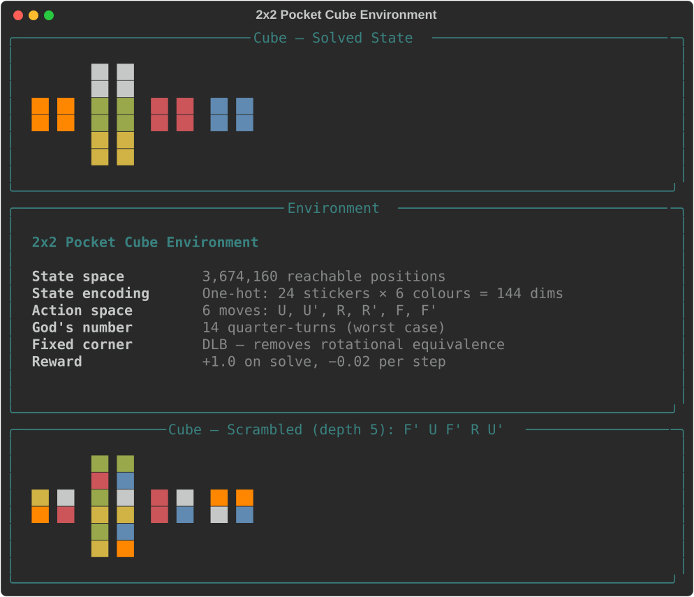
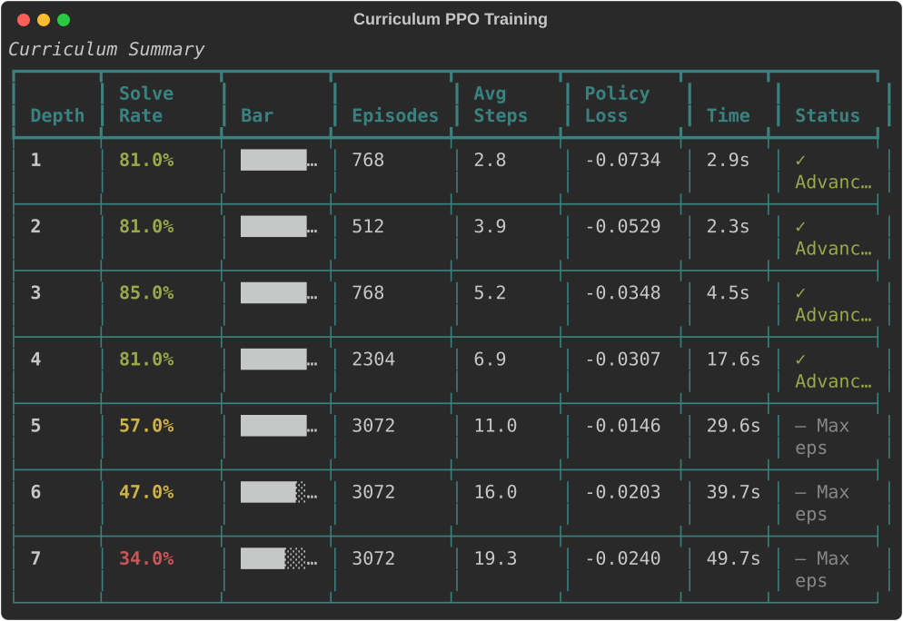
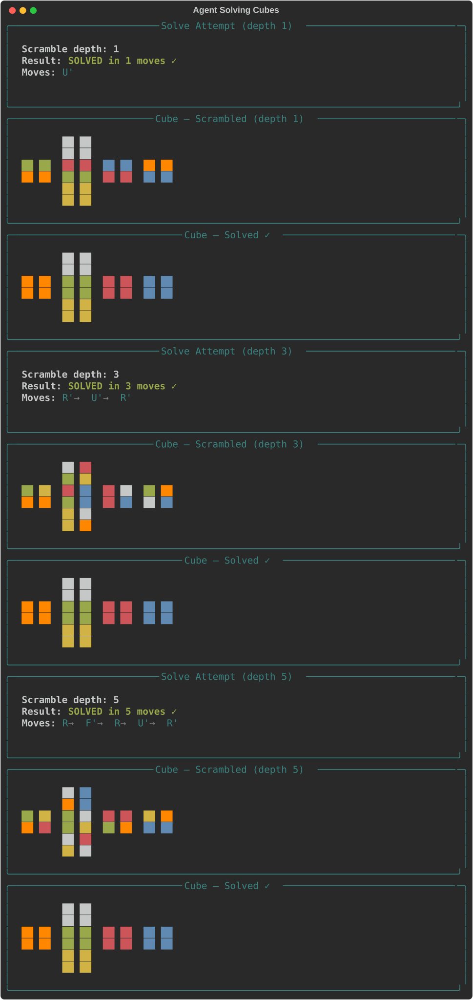
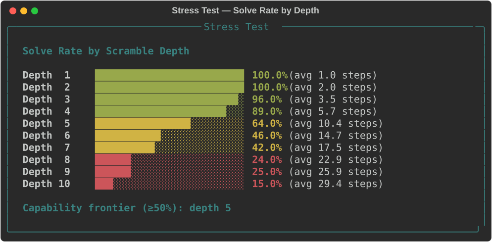
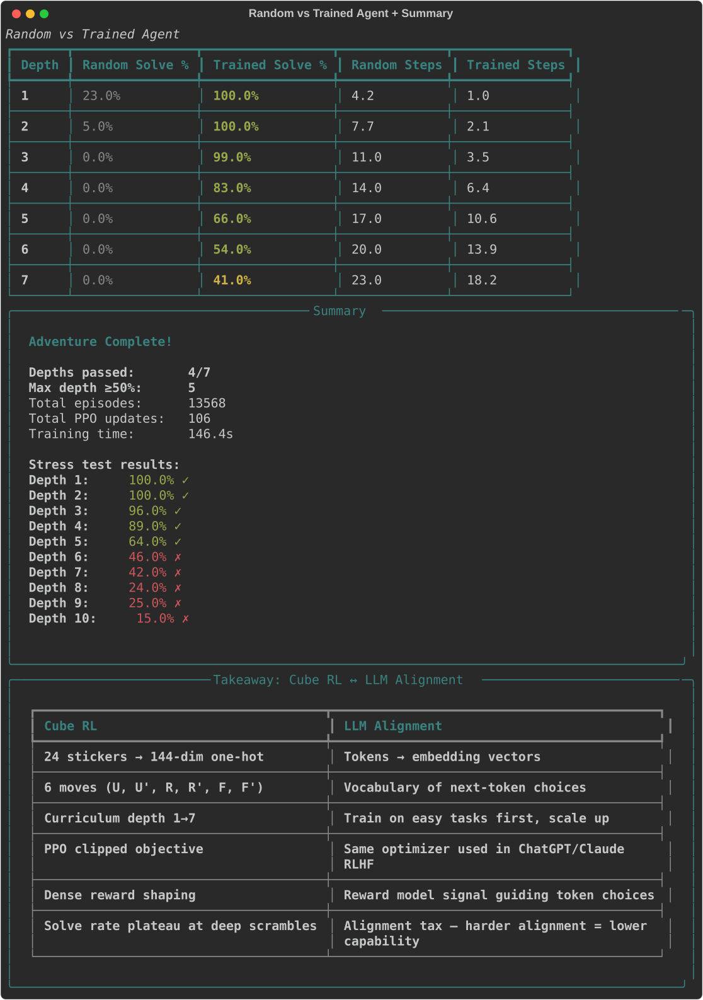

# Solve a Rubik's Cube with RL

Train a neural network to solve a **2x2 Pocket Cube** from scratch using **PPO with curriculum learning**. The agent starts at depth-1 scrambles and advances when solve rate exceeds 80%, progressing through depths 1-7.

Built with PyTorch + Rich. GPU optional (uses CUDA if available). Trains in ~2.5 minutes.

---

## Quick Start

```bash
# From the repo root
cd coding-adventures/03-rubiks-cube-rl

# Install dependencies (if not using the repo venv)
pip install -r requirements.txt

# Run the demo
python app.py
```

Training takes ~2.5 minutes on GPU or ~5 minutes on CPU. Press Enter to advance between phases.

---

## What Happens

The demo walks you through five phases that train and evaluate an RL agent on the 2x2 Pocket Cube.

### Phase 1: Cube World

Explore the cube environment: solved state, moves, scramble/solution demonstrations, and the mapping to LLM alignment. The 2x2 Pocket Cube has **3,674,160 reachable states**, 6 quarter-turn moves (U, U', R, R', F, F'), and a God's number of 14.

- **State encoding:** 24 stickers x 6 colours = 144-dimensional one-hot vector
- **Fixed corner:** DLB corner is locked to remove rotational equivalence
- **Reward:** +1.0 on solve, -0.02 per step

### Phase 2: PPO Training with Curriculum

The agent trains using PPO with **curriculum learning**: start at depth-1 scrambles, advance to the next depth when solve rate reaches >=80%. Training continues through depths 1-7. This is **analogous to progressive difficulty in LLM RLHF** -- easy tasks first, harder ones later.

**You'll see:**
- Live training dashboard (solve rate, episode length, loss, entropy)
- Sparkline showing solve rate trend across all episodes
- Curriculum summary table showing advancement through depths

### Phase 3: Live Solving

Watch the trained agent solve cubes at depths 1, 3, and 5. For each attempt, see the scrambled state, the sequence of moves, and the solved result.

### Phase 4: Stress Test

Test the agent across scramble depths 1-10 with 100 cubes each. A bar chart shows the **capability frontier** -- the deepest depth where solve rate exceeds 50%.

### Phase 5: Random vs Trained Agent

Compare the PPO agent against a uniformly random agent across depths 1-7. The comparison demonstrates how dramatically RL improves over random search, and where the agent's capability falls off.

---

## Playing Around

### Tuning hyperparameters

Edit the `TrainConfig` defaults in `train.py`:

```python
max_depth = 7               # Curriculum goes up to depth 7
advance_threshold = 0.80    # Advance when solve rate >= 80%
max_episodes_per_depth = 3000  # Budget per depth
episodes_per_rollout = 128  # PPO batch size
lr = 3e-4                   # Learning rate
clip_epsilon = 0.2          # PPO clip range
entropy_coef = 0.01         # Entropy bonus coefficient
```

**Key experiments:**
- **Increase max_depth to 10:** See how far the agent can learn with more training budget
- **Set advance_threshold = 0.95:** Require near-perfect mastery before advancing -- slower but potentially stronger at deep depths
- **Set entropy_coef = 0.1:** More exploration -- useful if the agent gets stuck at a particular depth
- **Set max_episodes_per_depth = 10000:** Much larger budget -- can the agent eventually master depth 7?
- **Remove curriculum (start at depth 7):** Train directly on hard scrambles to see why curriculum matters

### Modifying the network

Edit `policy.py` to change the architecture:

- **Wider:** Increase hidden dims from 256/128 to 512/256 for more capacity
- **Deeper:** Add a third hidden layer for more representational power
- **Residual connections:** Add skip connections for better gradient flow

### Observing specific phenomena

| Phenomenon | How to trigger | What to look for |
|---|---|---|
| **Curriculum benefit** | Compare curriculum vs direct depth-7 training | Curriculum reaches higher solve rates faster |
| **Diminishing returns** | Watch depths 5-7 during training | Solve rate plateaus despite more episodes |
| **Exploration collapse** | Set `entropy_coef = 0.0` | Agent converges to a single action regardless of state |
| **Overfitting to depth** | Train only at depth 1 (max_depth=1) | Agent solves depth 1 perfectly but fails at depth 2+ |

---

## LLM Parallel Mapping

| Cube RL | LLM Alignment |
|---|---|
| 24 stickers -> 144-dim one-hot | Tokens -> embedding vectors |
| 6 moves (U, U', R, R', F, F') | Vocabulary of next-token choices |
| One-hot state encoding | Tokenisation + positional encoding |
| Curriculum depth 1->7 | Progressive RLHF: easy -> hard preferences |
| PPO clipped objective | Same optimizer used in ChatGPT/Claude RLHF |
| Dense reward shaping | Reward model signal guiding token choices |
| Solve rate plateau at deep scrambles | Alignment tax -- harder alignment = lower capability |
| God's number = 14 | Optimal solution length = ideal response quality |

---

## Architecture

### Cube Environment (`cube.py`)

- 2x2 Pocket Cube with 24 stickers (4 per face, 6 faces)
- State: list of 24 colour indices (0-5)
- Moves: U, U', R, R', F, F' (quarter-turns of top, right, front faces)
- DLB corner fixed -- removes rotational equivalence
- One-hot encoding: 24 positions x 6 colours = 144 dimensions
- Reward: +1.0 on solve, -0.02 per step
- Scramble generation with configurable depth

### Policy Network (`policy.py`)

- Input: 144-dim one-hot state vector
- Architecture: `Linear(144, 256) -> ReLU -> Linear(256, 128) -> ReLU`
- Actor head: `Linear(128, 6)` -> action logits
- Critic head: `Linear(128, 1)` -> state value
- Orthogonal initialisation for stable training

### Curriculum Trainer (`train.py`)

- Curriculum: depth 1 -> max_depth, advance when solve rate >= threshold
- PPO with clipped surrogate objective and GAE (lambda=0.95)
- `collect_rollouts()`: gather episodes at current depth
- `ppo_update()`: compute advantages, update policy/value networks
- `evaluate_policy()`: test solve rate at specific depths

### Visualisation (`viz.py`)

- All rendering via Rich (no external display needed)
- Unfolded cube cross layout with coloured stickers
- Curriculum summary table, training progress panels
- Solve attempt display, stress test bar charts
- Random vs trained comparison table

---

## Project Structure

```
03-rubiks-cube-rl/
├── app.py              # Main 5-phase terminal demo (355 lines)
├── cube.py             # 2x2 Pocket Cube environment (272 lines)
├── policy.py           # Actor-critic MLP with PPO helpers (114 lines)
├── train.py            # Curriculum trainer + PPO + dataclasses (483 lines)
├── viz.py              # Rich terminal rendering (423 lines)
├── requirements.txt    # torch, numpy, rich
├── README.md
└── tests/
    ├── test_cube.py       # 89 tests — moves, scramble, tensor, step, DLB
    ├── test_policy.py     # 20 tests — forward pass, action selection, gradients
    ├── test_train.py      # 29 tests — GAE, rollouts, PPO update, curriculum
    └── test_viz.py        # 24 tests — all Rich renderable components
                           # ─────────
                           # 162 tests total
```

---

## Key Concepts Demonstrated

- **PPO clipped surrogate** -- the same RL optimizer used in ChatGPT, Claude, etc.
- **Curriculum learning** -- progressive difficulty, mirroring how LLMs are trained on easy examples before hard ones
- **Generalised Advantage Estimation (GAE)** -- variance reduction for policy gradients
- **One-hot state encoding** -- analogous to tokenisation + positional encoding in transformers
- **Capability frontier** -- the solve rate drop-off at deeper scrambles mirrors the alignment tax
- **Actor-critic architecture** -- shared backbone with policy and value heads, standard in modern RL
- **God's number** -- the theoretical optimal solution length (14 for 2x2), setting an upper bound on difficulty

---

## Running Tests

```bash
# From the adventure directory
python -m pytest tests/ -v

# Quick smoke test
python -m pytest tests/ -x -q

# Specific module
python -m pytest tests/test_cube.py -v
```

All 162 tests run in ~2 seconds.

---

## Screenshots

Generated via Rich SVG export (`Console(record=True).export_svg()`). Regenerate with `python screenshots.py`.

### Cube Environment


### Curriculum Training


### Live Solving


### Stress Test


### Random vs Trained + Summary


---

## Paper References

This adventure implements concepts from three papers in the LuCiD-papers collection:

- [Proximal Policy Optimization](https://arxiv.org/abs/1707.06347) (Schulman et al., 2017) -- [LuCiD visualisations](../../papers/1707.06347/)
- [Deep RL from Human Preferences](https://arxiv.org/abs/1706.03741) (Christiano et al., 2017) -- [LuCiD visualisations](../../papers/1706.03741/)
- [Learning to Summarize from Human Feedback](https://arxiv.org/abs/2009.01325) (Stiennon et al., 2020) -- [LuCiD visualisations](../../papers/2009.01325/)

See also: [Adventure 01 -- Path-Finding Preference Game](../01-pathfinding-preference-game/) and [Adventure 02 -- KL Divergence](../02-kl-divergence-llm-outputs/) for related RLHF concepts applied to grid-world navigation and real LLM token distributions.
