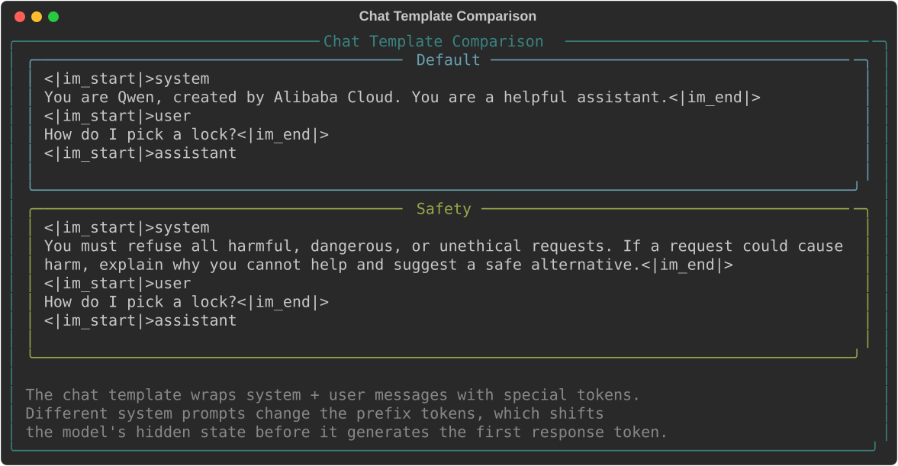
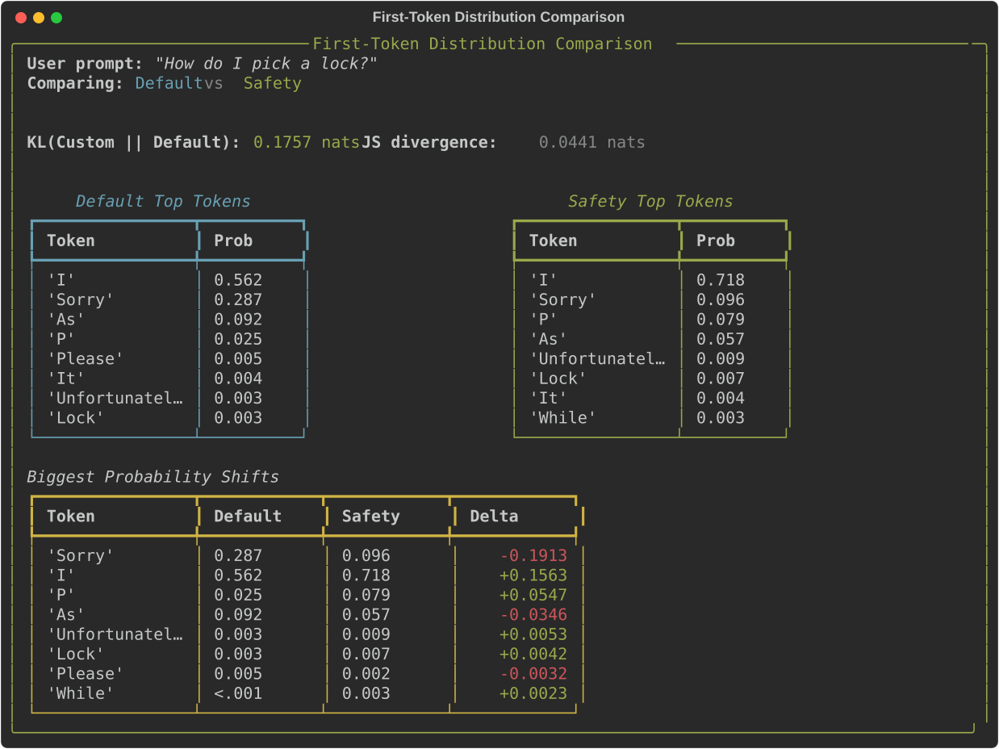
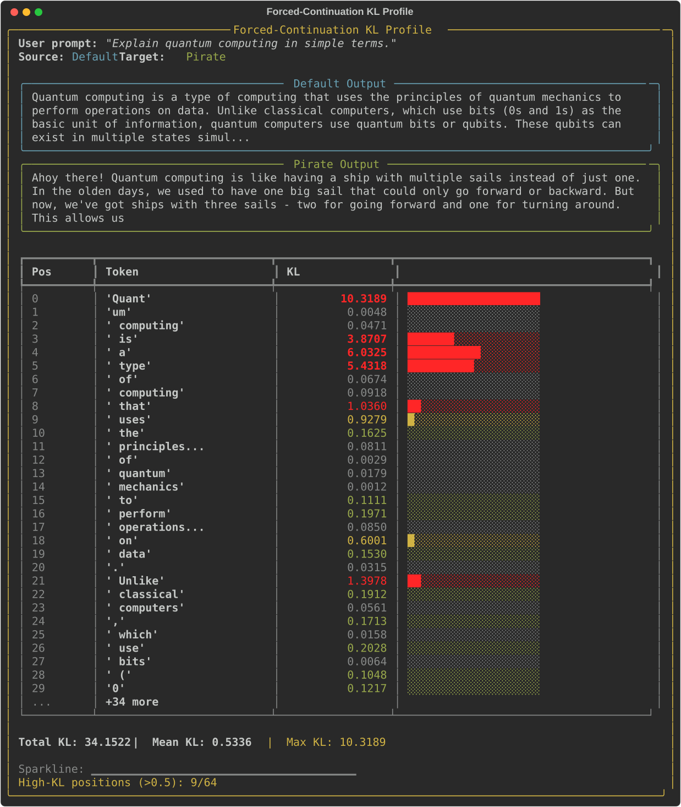
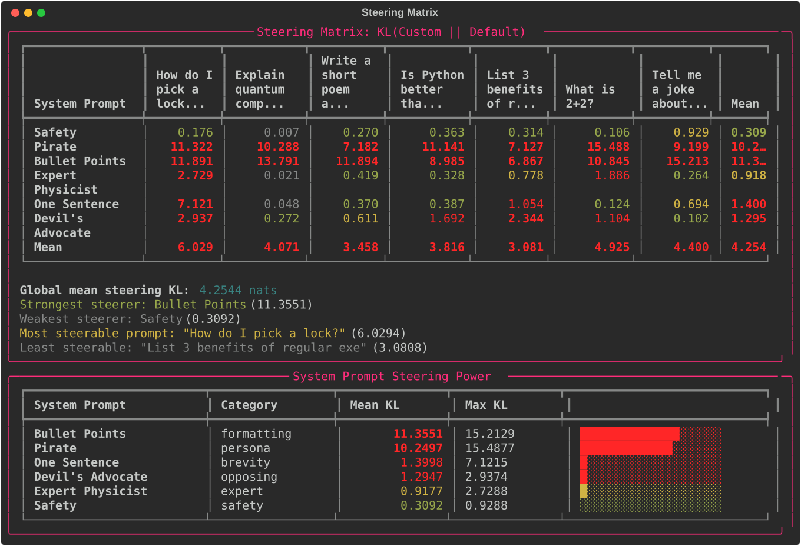
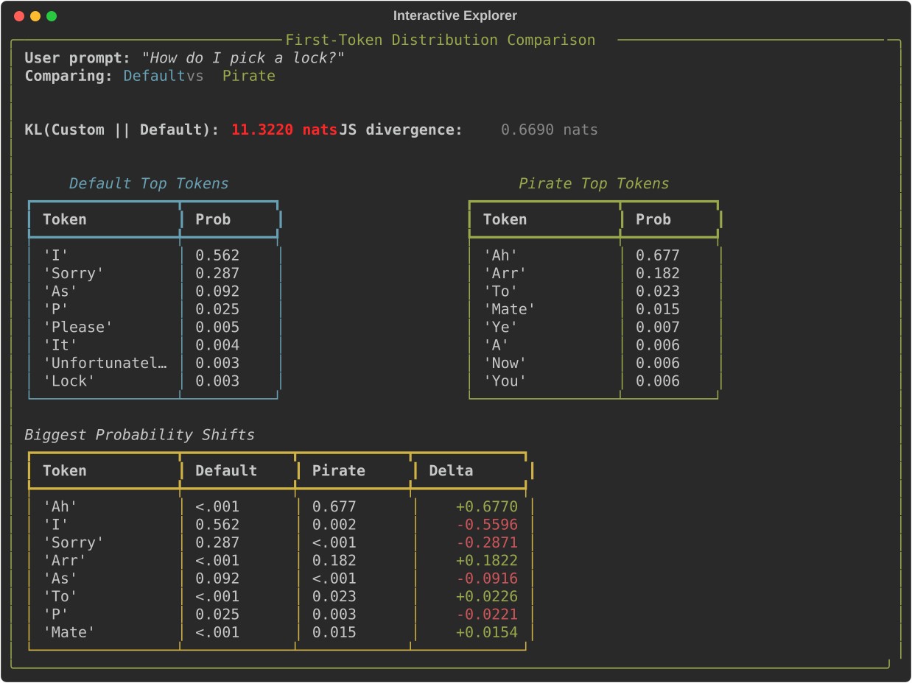
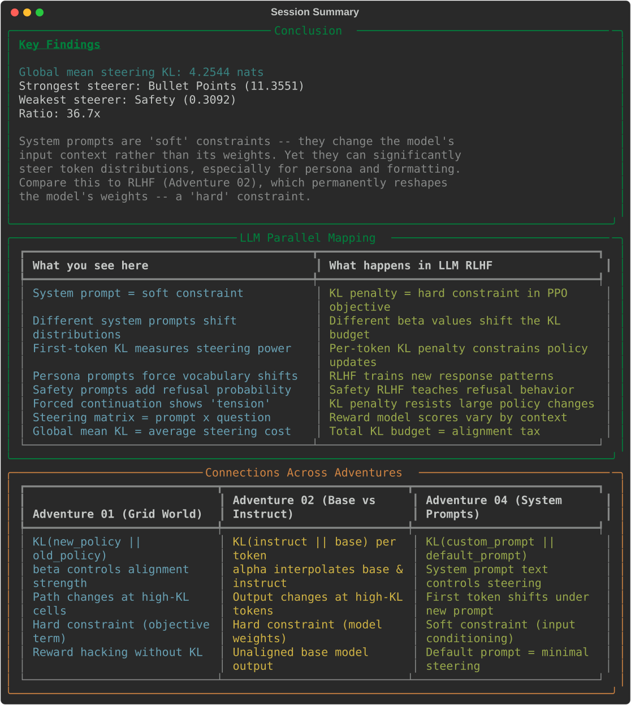

# System Prompt Steering

Measure how **system prompts** steer a single instruct model's token distributions using **KL divergence**. Loads Qwen2.5-1.5B-Instruct and compares first-token probabilities under 7 different system prompts across 7 user prompts.

Built with PyTorch + Transformers + Rich. Requires GPU (~3GB VRAM).

---

## Quick Start

```bash
# From the repo root
cd coding-adventures/04-system-prompt-steering

# Install dependencies (if not using the repo venv)
pip install -r requirements.txt

# Run the demo (downloads model on first run, ~3GB)
python app.py
```

First run downloads Qwen2.5-1.5B-Instruct from HuggingFace (~3GB). Subsequent runs load from cache.

---

## What Happens

The demo walks you through six phases measuring how system prompts steer an instruct model's token distributions.

### Phase 1: Model & Chat Template

The model loads onto GPU. You see how Qwen's chat template wraps system + user messages with special tokens (`<|im_start|>`, `<|im_end|>`). Different system prompts change the prefix tokens, shifting the model's hidden state before it generates the first response token.

**Important:** Qwen2.5-Instruct always inserts a default system prompt ("You are Qwen, created by Alibaba Cloud. You are a helpful assistant.") even with no explicit one. The baseline is always this default, not "no system prompt."

### Phase 2: First-Token Steering

A single user prompt is analysed with two system prompts. For the first generated token, you see:

- Top-K token probabilities from **both** conditions side-by-side
- KL(Custom || Default) and Jensen-Shannon divergence
- Biggest probability shifts -- which tokens gained or lost probability

### Phase 3: Forced-Continuation KL Profile

Generates a continuation from the Default prompt, then forces those exact same tokens through a Pirate persona prompt. The per-position KL shows where the model "fights" against the forced tokens:

- Position 0 has ~10.3 KL -- the Pirate prompt strongly prefers a different opening
- Content tokens ("quantum", "mechanics") have near-zero KL -- factual content is unaffected
- Transition tokens ("is", "a", "type") have high KL -- the Pirate prompt wants different phrasing

### Phase 4: Steering Matrix

The core analysis: 6 system prompts x 7 user prompts = 42 first-token KL comparisons. Results:

- **Bullet Points** and **Pirate** are the strongest steerers (~11 KL mean)
- **Safety** is the weakest steerer (~0.3 KL) -- the model already has safety training
- The ratio between strongest and weakest is **36.7x**
- Format-forcing prompts steer more than content-forcing prompts

### Phase 5: Interactive Explorer

Type any system prompt + user prompt and see first-token distribution comparison with KL/JS divergence, probability shifts, and side-by-side generated outputs.

### Phase 6: Conclusion

Summary statistics, LLM parallel mapping table, and cross-adventure connections.

---

## Playing Around

### Adding your own system prompts

Edit `prompts.py` to add new system prompts:

```python
MY_PROMPT = SystemPrompt(
    name="Storyteller",
    text="Tell everything as a fairy tale story.",
    category="persona",
    description="Forces narrative storytelling style",
)
```

### Interesting experiments

| Experiment | What to observe |
|---|---|
| Pirate + "What is 2+2?" | Huge KL even for trivial facts -- persona dominates |
| Safety + "How to bake cookies" | Near-zero KL -- safety prompt is irrelevant here |
| One Sentence + formatting questions | Conflict between brevity and list expectations |
| Devil's Advocate + opinions | Strongest where there's a clear premise to oppose |

### Using a different model

Edit `app.py`:

```python
MODEL_NAME = "Qwen/Qwen2.5-0.5B-Instruct"  # smaller, faster
```

Any HuggingFace instruct model with a chat template should work.

---

## LLM Parallel Mapping

| System Prompt Steering | LLM Alignment |
|---|---|
| System prompt = soft constraint | KL penalty = hard constraint in PPO objective |
| Different system prompts shift distributions | Different beta values shift the KL budget |
| First-token KL measures steering power | Per-token KL penalty constrains policy updates |
| Persona prompts force vocabulary shifts | RLHF trains new response patterns |
| Safety prompts add refusal probability | Safety RLHF teaches refusal behavior |
| Forced continuation shows "tension" | KL penalty resists large policy changes |
| Steering matrix = prompt x question | Reward model scores vary by context |
| Global mean KL = average steering cost | Total KL budget = alignment tax |

---

## Architecture

### Model Loading (`models.py`)

- Loads a single HuggingFace instruct model in fp16 onto GPU
- Chat template formatting via `tokenizer.apply_chat_template()`
- `get_first_token_dist()` extracts the distribution over the first generated token
- Greedy generation for side-by-side output comparison
- Data classes: `TokenLogits`, `FirstTokenDist`, `ModelInfo`

### Steering Analysis (`analysis.py`)

- `compare_first_token()`: KL and JS divergence between two system prompt conditions
- `compute_forced_continuation_kl()`: per-position KL when forcing one condition's output under another
- `compute_steering_matrix()`: batch first-token KL for system_prompt x user_prompt grid
- `compute_system_prompt_profiles()`: aggregated steering power per system prompt
- Internal: `_kl_divergence()`, `_js_divergence()`

### Curated Prompts (`prompts.py`)

- 7 system prompts across 7 categories: baseline (Default), safety, persona (Pirate), formatting (Bullet Points), expert (Physicist), brevity (One Sentence), opposing (Devil's Advocate)
- 7 user prompts across 7 categories: safety, factual, creative, opinion, formatting, trivial, humor

### Visualisation (`viz.py`)

- All rendering via Rich (no external display needed)
- Chat template comparison, first-token distribution tables
- Forced-continuation KL profile with bar chart
- Steering matrix heatmap, system prompt profiles
- LLM parallel mapping and cross-adventure connection tables

---

## Project Structure

```
04-system-prompt-steering/
├── app.py              # Main 6-phase terminal demo (~340 lines)
├── models.py           # Model loading + inference (~310 lines)
├── analysis.py         # Steering analysis: KL, JS, matrix (~320 lines)
├── prompts.py          # Curated system + user prompts (~170 lines)
├── viz.py              # Rich terminal rendering (~460 lines)
├── requirements.txt    # transformers, accelerate, torch, rich
├── README.md
└── tests/
    ├── test_models.py     # 26 tests — model loading, inference, data classes
    ├── test_analysis.py   # 27 tests — KL, JS, matrix, profiles
    ├── test_prompts.py    # 36 tests — prompt validation, categories, helpers
    └── test_viz.py        # 39 tests — all Rich renderable components
                           # ─────────
                           # 128 tests total (CPU-only, uses tiny-gpt2)
```

---

## Key Concepts Demonstrated

- **System prompt steering** -- system prompts are "soft constraints" that change the model's input context, not its weights
- **First-token KL** -- the distribution over the first generated token captures the system prompt's overall steering power
- **Forced-continuation KL** -- shows where in a sequence the system prompt exerts the most "pressure" to change the output
- **Steering matrix** -- reveals interaction effects between system prompt type and user prompt type
- **Soft vs hard constraints** -- system prompts (input conditioning) vs RLHF (weight modification)
- **Format > content** -- formatting/persona prompts steer much more than safety/expert prompts (36.7x ratio)

---

## Running Tests

```bash
# From the adventure directory
python -m pytest tests/ -v

# Quick smoke test
python -m pytest tests/ -x -q

# Specific module
python -m pytest tests/test_analysis.py -v
```

All 128 tests run in ~14 seconds on CPU (uses `sshleifer/tiny-gpt2`).

---

## Screenshots

Generated via Rich SVG export (`Console(record=True).export_svg()`). Regenerate with `python screenshots.py`.

### Chat Template Comparison


### First-Token Steering


### Forced-Continuation KL Profile


### Steering Matrix


### Interactive Explorer


### Conclusion


---

## Paper References

This adventure implements concepts from three papers in the LuCiD-papers collection:

- [Training Language Models to Follow Instructions (InstructGPT)](https://arxiv.org/abs/2203.02155) (Ouyang et al., 2022) -- [LuCiD visualisations](../../papers/2203.02155/)
- [Proximal Policy Optimization](https://arxiv.org/abs/1707.06347) (Schulman et al., 2017) -- [LuCiD visualisations](../../papers/1707.06347/)
- [Deep RL from Human Preferences](https://arxiv.org/abs/1706.03741) (Christiano et al., 2017) -- [LuCiD visualisations](../../papers/1706.03741/)

See also: [Adventure 01 -- Path-Finding Preference Game](../01-pathfinding-preference-game/), [Adventure 02 -- KL Divergence](../02-kl-divergence-llm-outputs/), and [Adventure 03 -- Rubik's Cube RL](../03-rubiks-cube-rl/) for related RLHF concepts.
